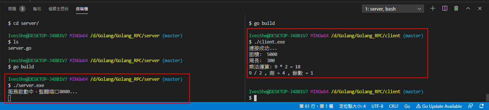

# Golang RPC

golang RPC練習

# Golang的RPC必須符合4個條件

1. 結構體字段要大寫，要跨域訪問，所以大寫
2. 函數名必須首字母大寫
3. 函數第一個參數是接收參數，第二個參數是返回給客戶端參數，必須是指針類似
4. 函數必須有一個返回值error

# 練習：

1. golang實現RPC程序，實現求矩形面積和周長
2. golang實現RPC程序，實現乘法運算、求商及餘數

# 執行畫面



# server.go

```go
package main

import (
	"errors"
	"fmt"
	"log"
	"net/http"
	"net/rpc"
)

// 服務端，求矩形面績和週長

// 聲明矩形對象
type Rect struct {
}

// 聲明參數結構體，字段首字母大寫
type Params struct {
	// 長和寬
	Width  int
	Height int
}

// 定義求矩形面積的方法
func (r *Rect) Area(p Params, res *int) error {
	*res = p.Width * p.Height
	return nil
}

// 定義求矩形周長的方法
func (r *Rect) Perimeter(p Params, res *int) error {
	*res = (p.Width + p.Height) * 2
	return nil
}

// 聲明算術運算結構體
type Arith struct {
}

// 聲明接收的參數結構體
type ArithRequest struct {
	A int
	B int
}

// 聲明返回客戶端參數結構體
type ArithResponse struct {
	// 乘積
	Product int

	// 商
	Quotient int

	// 餘數
	Remainder int
}

// 乘法運算
func (a *Arith) Multiply(req ArithRequest, res *ArithResponse) error {
	res.Product = req.A * req.B
	return nil
}

// 商和餘數
func (a *Arith) Divide(req ArithRequest, res *ArithResponse) error {
	if req.B == 0 {
		return errors.New("餘數不能為0")
	}

	// 商
	res.Quotient = req.A / req.B

	// 餘數
	res.Remainder = req.A % req.B

	return nil
}

func main() {
	// 1.註冊服務
	rect := new(Rect)
	rpc.Register(rect)

	arith := new(Arith)
	rpc.Register(arith)

	// 2.把服務處理綁定到http協議上
	rpc.HandleHTTP()

	// 3.監聽服務，等待客戶端調用求面積和周長的方法
	fmt.Println("服務啟動中，監聽端口8080...")
	err := http.ListenAndServe(":8080", nil)
	if err != nil {
		log.Fatal(err)
	}
}
```

# client.go

```go
package main

import (
	"fmt"
	"log"
	"net/rpc"
)

// 聲明參數結構體，字段首字母大寫
type Params struct {
	// 長和寬
	Width  int
	Height int
}

// 聲明接收的參數結構體
type ArithRequest struct {
	A int
	B int
}

// 聲明返回客戶端參數結構體
type ArithResponse struct {
	// 乘積
	Product int

	// 商
	Quotient int

	// 餘數
	Remainder int
}

// 調用服務
func main() {
	// 1.連接遠程RPC服務
	conn, err := rpc.DialHTTP("tcp", "127.0.0.1:8080")
	if err != nil {
		log.Fatal(err)
	}
	fmt.Println("連接成功...")

	// 2.調用遠程方法
	// 定義接收服務端傳回來的計算結果的變量
	resRect := 0
	var res ArithResponse

	// 求面積
	err = conn.Call("Rect.Area", Params{50, 100}, &resRect)
	if err != nil {
		log.Fatal(err)
	}

	fmt.Println("面積: ", resRect)

	// 求周長
	err = conn.Call("Rect.Perimeter", Params{50, 100}, &resRect)
	if err != nil {
		log.Fatal(err)
	}

	fmt.Println("周長: ", resRect)

	// 求乘積
	req := ArithRequest{9, 2}
	err = conn.Call("Arith.Multiply", req, &res)
	if err != nil {
		log.Fatal(err)
	}

	fmt.Printf("乘法運算: %d * %d = %d  \n", req.A, req.B, res.Product)

	// 求商和餘數
	err = conn.Call("Arith.Divide", req, &res)
	if err != nil {
		log.Fatal(err)
	}

	fmt.Printf("%d / %d , 商 = %d , 餘數 = %d\n  \n", req.A, req.B, res.Quotient, res.Remainder)
}
```